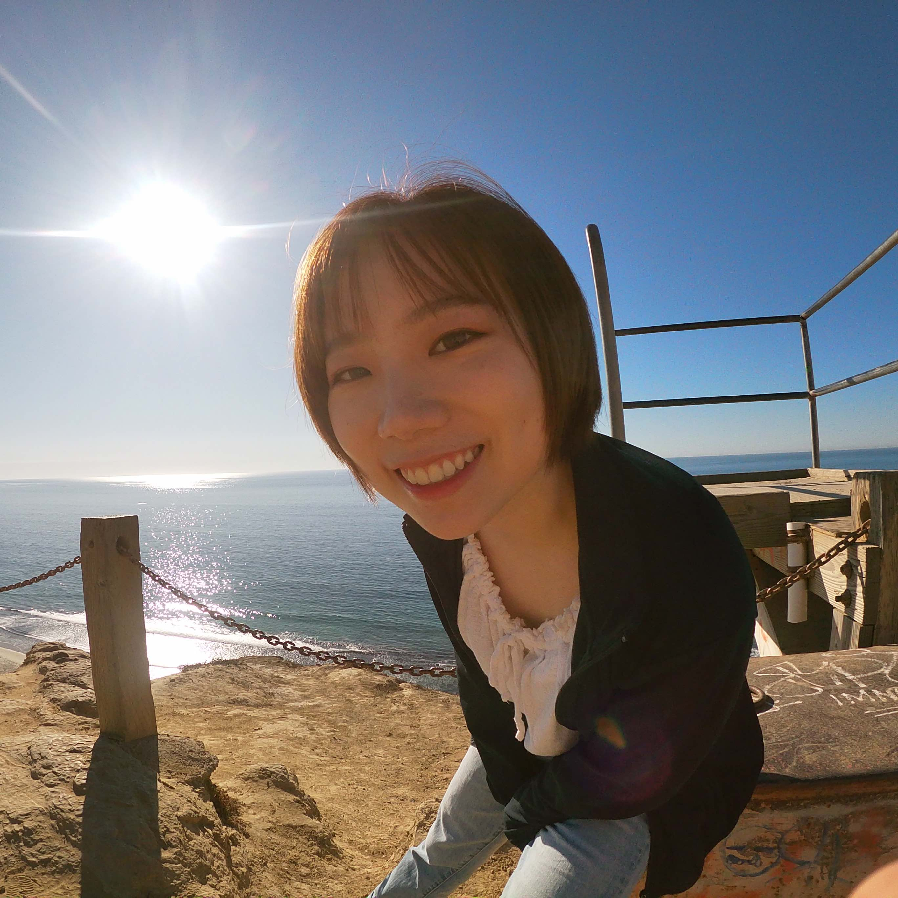

```{r, echo = FALSE }
library(fontawesome)
```
<br>
<center>

</center>
<br>

  
  I'm a PhD student in Biostatistics at Keck School of Medicine, University of Southern California. 
  

<style>
.column-left{
  float: left;
  width: 50%;
  text-align: left;
}
.column-right{
  float: right;
  width: 50%;
  text-align: left;
}
</style>


<div class="column-left">
### `r fa("seedling")` Interests
* Statistical Genetics  
* Bioinformatics  
* Causal Inference 
</div>

<div class="column-right">
### `r fa("briefcase")` Skills
* R 
* SAS  
* MATLAB  
</div>
   
  
   Feel free to navigate around my website. If you have any question, you can shoot me an email or DM me on Linkedin. 
   
<br>